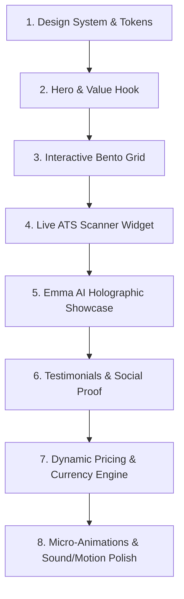

# JobGen.AI (Candidates) — Comprehensive Website Research & Premium Redesign Strategy

> **Target URL:** `https://candidates.jobgen.ai/`  
> **Brand Name:** JobGen.AI (Candidate Platform)  
> **Date of Audit:** September 2026  
> **Purpose:** Comprehensive architectural, functional, content, and aesthetic teardown with an actionable roadmap for a **world-class, premium, and trendy** redesign.

---

## 1. Executive Summary & Brand Positioning

**JobGen.AI** is an AI-powered end-to-end career platform designed to help job seekers land roles faster and smarter. Unlike single-feature resume builders (e.g., Novoresume) or generic AI text tools (e.g., ChatGPT wrappers), JobGen unites **ATS resume optimization, cover letter generation, multi-platform job tracking, Chrome extension autofill, AI interview preparation, and 30/60/90-day career planning** into a single cohesive ecosystem.

- **Primary Value Proposition:** *"Tired of applying blind? Apply smarter. Tailor every application, track every opportunity, and prepare for interviews in one connected workspace."*
- **Hero CTA:** Free ATS Resume Score (Zero-barrier hook requiring no credit card).
- **Core AI Agent Persona:** **Emma** — an intelligent, context-aware AI job search assistant that knows the candidate's career history, target jobs, and interview preparation.
- **Target Audience:** Modern job seekers (software engineers, product managers, designers, consultants, career changers, corporate professionals) in Australia, New Zealand, the US, UK, and India applying across LinkedIn, Seek, and Indeed.

---

## 2. Complete Information Architecture & Site Map

### 2.1 Public & Marketing Pages
| Route | Page Name | Primary Objective |
| :--- | :--- | :--- |
| `/` | **Landing Page** | High-conversion portal: Value prop, interactive feature demo, ATS resume dropzone, Emma AI agent showcase, social proof, dynamic pricing, and FAQ. |
| `/emma` | **Emma AI Showcase** | Dedicated deep dive into Emma, the AI agent assisting candidates with contextual suggestions. |
| `/tools/resume-score` | **Free ATS Resume Score Tool** | Standalone high-conversion SEO tool for instant resume scoring and keyword gap analysis. |
| `/features/resume-builder` | **Feature: AI Resume Builder** | Dedicated landing page for ATS-tailored resume generation. |
| `/features/cover-letter` | **Feature: Cover Letter Builder** | Dedicated landing page for role-specific cover letter drafts. |
| `/features/job-search` | **Feature: AI Job Search** | Smart search aggregator with match scoring. |
| `/features/job-tracker` | **Feature: Application Tracker** | Centralized Kanban & list tracker for all applications. |
| `/features/chrome-extension`| **Feature: Chrome Extension** | 1-click job saver & auto-fill extension for LinkedIn, Seek, Indeed. |
| `/features/interview-prep` | **Feature: Interview Prep** | AI mock interviews, behavioral response scoring (STAR method), and practice. |
| `/features/career-plan` | **Feature: Career Plan** | Structured 30/60/90-day onboarding roadmap and multi-year career pacing. |
| `/resume-examples` | **Resume Examples Directory** | Indexed ATS resume templates by industry, role, and seniority level. |
| `/partners` | **Partner / Affiliate Portal** | Commission structure, partner dashboard, and referral resources. |
| `/sign-up` & `/login` | **Authentication** | Email magic link, Google OAuth, and Apple Sign-In. |
| `/privacy`, `/termsofservice`, `/subscription-terms` | **Legal & Compliance** | Data protection, GDPR/APPs compliance, refund and billing terms. |

### 2.2 Authenticated Candidate Web Application
| Route | Module | Key Features |
| :--- | :--- | :--- |
| `/home` | **Candidate Command Center** | Real-time application metrics, next-action reminders, recent activity, recommended jobs. |
| `/job-search` | **Job Discovery Engine** | Live job listings with personalized match percentage scores. |
| `/tracker?tab=jobs` | **Pipeline Tracker** | Kanban stages: Saved, Applied, Interviewing, Offer, Archived with email auto-sync. |
| `/resume-builder/resume` | **ProseMirror Resume Studio** | Master resume editor, job tailoring engine, multiple export templates (`Classic`, `Advisory`, `Portfolio`, `Bureau`, `Precision`, `Formal`). |
| `/cover-letter-builder` | **Cover Letter Studio** | Connected cover letters pulling bullet points from master resume and job description. |
| `/workspace?tab=resumes` | **Asset Workspace** | Version management for all tailored resumes, cover letters, and notes. |
| `/interview-prep` | **AI Mock Interview Coach** | Role-tailored questions, audio/text responses, STAR-format critiques, and confidence scoring. |
| `/career-events` | **Event & Follow-Up Tracker**| Reminders for recruiter follow-ups, interview dates, and networking checkpoints. |
| `/career-plan` | **Career Growth Blueprint** | Pacing selector (1-mo sprint, 3-mo balanced, 6-mo strategic, 12-mo alignment) & first 90-day plan. |

---

## 3. Landing Page Breakdown: Current Content & Structure

### Section 1: Sticky Glassmorphic Navbar (`NavbarLight`)
- **Brand Lockup:** JobGen.AI logo with blue gradient wordmark.
- **Navigation Links:**
  - *Features (Mega-Menu):* Resume Builder, Cover Letter Builder, Job Search, Job Tracker, Chrome Extension, Interview Prep, Career Plan.
  - *Pricing:* Direct scroll link to `#pricing`.
  - *Academy:* Outbound link to educational resources (`https://academy.jobgen.ai/`).
- **Right Actions:**
  - *Sign In* text link.
  - *Primary CTA Button:* "Try JobGen Free" (navigates to `/sign-up` or `/home` if session active).

### Section 2: Hero Section (`HeroLight`)
- **Backdrop:** Light pastel vertical gradient (`linear-gradient(180deg, #dceafd 0%, #edf4fd 48%, #ffffff 100%)`) with top radial white glare.
- **Headline:**
  > *"Tired of applying blind?"*  
  > **"Apply smarter."** (rendered in vibrant blue gradient)
- **Subheadline:**  
  *"Tailor every application, track every opportunity, and prepare for interviews in one connected workspace."*
- **Action Group:**
  - Primary CTA: **"Get your free resume score"** (triggers instant modal dropzone).
  - Secondary CTA: **"Overview"** (opens embedded YouTube product demo `XHsBN28qN-c`).

### Section 3: Interactive Product Feature Showcase (`ProductFeatureShowcase`)
- **Interactive Tabs:**
  1. **Overview** (Interactive video presentation)
  2. **Resume Builder** (AI suggestions grounded in actual candidate evidence)
  3. **Job Tracker** (Auto-sync with browser extension, pipeline stages)
  4. **Chrome Extension** (1-click job saving and autofill on LinkedIn/Seek/Indeed)
  5. **Interview Prep** (AI mock questions, answer grading, STAR framework)
  6. **Career Plan** (Milestone tracking, first 90-day roadmaps)
- **Visual Display:** High-resolution product mockups (`1400x876`) switching dynamically per tab.

### Section 4: Social Proof & Hiring Trust Bar (`TrustBar`)
- **Header:** *"Trusted by users who have been hired by"*
- **Company Logos:** Atlassian, Canva, Afterpay, Deloitte, Microsoft, Amazon, Visa.
- **Styling:** Monochromatic grayscale SVGs with hover-to-color transition.

### Section 5: Interactive Diagnostic — Free ATS Resume Check (`HowItWorks`)
- **Headline:** *"Get your free ATS resume score."*
- **Subheadline:** *"See how well your resume matches the role and exactly what to improve before you apply."*
- **Interactive Steps:**
  1. *Upload your resume:* Drag-and-drop zone supporting `.pdf`, `.doc`, `.docx`.
  2. *Add job details:* Paste target job title and description.
  3. *Get your score:* Instant ATS breakdown showing Match Score %, Missing Keywords, and Priority Fixes.

### Section 6: AI Persona Feature — Meet Emma (`EmmaTeaser`)
- **Visual Theme:** Contrasting deep navy dark theme (`#071d52`) with glowing violet radial orb (`rgba(139,92,246,0.42)`).
- **Badge:** *"Available for eligible accounts"*
- **Headline:** *"Meet Emma — Job-search help with your JobGen context."*
- **Subtext:** *"Emma can help eligible accounts make sense of their profile, resume, applications, linked jobs, and next steps while keeping important decisions in their hands."*
- **Visual Elements:**
  - Circular avatar (`/Emma.jpeg`) with animated emerald green active pulse badge.
  - Three key value pillars:
    - *Reviews your resume with the target job in view*
    - *Helps prioritise the experience that matters*
    - *Proposes improvements you approve before applying*
- **CTA:** "Explore Emma" button linking to `/emma`.

### Section 7: Verified Testimonials & Wall of Love (`Testimonials`)
- **Source:** Verified Chrome Web Store reviews with 5-star ratings.
- **Featured Outcomes:**
  - *Daniel Bae:* "Productivity boost — Helped me be much more productive."
  - *Kulbir Kaur:* "Saves me 10+ hours a week and tripled my interview hit rate. Feels like having an AI job coach + recruiter in one."
  - *Akash Shelly:* "Save jobs directly from LinkedIn, Seek, and Indeed with one click... automatically tailors my resume and tracks applications."
  - *Gautam Malik:* "AI suggestions felt personal and accurate, not generic like other tools."
  - *Prithviraaj Balachandar:* "Simplifies the process... keeps everything organised in one place."

### Section 8: Pricing Matrix (`Pricing`)
- **Header:** *"Start free. Upgrade when you want the full engine."*
- **Billing Toggle:** Monthly / Quarterly / Yearly (with annual discount savings ribbon).
- **Multi-Currency Geo-Detection:** Auto-adjusts for USD ($20/mo), AUD ($29/mo), NZD, and INR.
- **Tiers:**
  1. **JobGen.AI Free ($0 forever / No credit card required):**
     - Save jobs in 1 click while you browse
     - Job match score for your first 5 jobs
     - 1 AI-tailored resume every month
     - Application tracker
     - Career guides & salary insights
     - 1 interview prep session
     - Community support
  2. **JobGen.AI Premium ($20/mo / 7-Day Free Trial):**
     - Unlimited AI resumes & cover letters
     - Unlimited job match scoring
     - 1-click Auto-fill job applications
     - Full interview prep + AI mock interview
     - LinkedIn profile optimizer
     - Personalized career pathway planner
     - Recruiter outreach emails generated by AI
     - Advanced application tracker with auto-sync
     - Priority customer support

### Section 9: Frequently Asked Questions Accordion (`Faq`)
1. *Is JobGen.AI free, and do I need a credit card?* (Clarifies generous free tier with zero payment details).
2. *Can I upload and edit my existing resume?* (Explains document parser and ProseMirror rich editor).
3. *How do the ATS match score and resume tailoring work?* (Deep explanation of semantic matching vs keyword stuffing).
4. *Will the AI invent or change my experience?* (Crucial trust pillar: guarantees no hallucinated or fabricated credentials).
5. *What does the Chrome extension do — and does JobGen apply automatically?* (Clarifies candidate retains final review & submission control).
6. *How is my resume and personal data protected?* (Encrypted in transit & at rest; never sold or used to train public LLMs).

### Section 10: Footer (`Footer`)
- **Background:** Obsidian dark navy (`#080e24`) with hairline border (`rgba(255,255,255,0.07)`).
- **Navigation Columns:** Product, Career Support, Company, Help & Legal.
- **Meta:** Copyright (JobGen Pty Ltd), terms, privacy policy, and social handles.

### Section 11: Floating Social Proof Notifications (`SocialProofToast`)
- Dynamic sliding toasts showing real-time candidate actions across Australian & international cities (e.g., *"Candidate from Sydney just scored an ATS resume — 88% Match"*).

---

## 4. Current Design System & Aesthetic Analysis

### 4.1 Color Palette
| Token Name | Current Value | Role & Usage | Aesthetic Critique |
| :--- | :--- | :--- | :--- |
| Primary Brand Blue | `#1A53CF` / `#1055eb` | Buttons, badges, active tabs, links | Solid enterprise blue, but lacks modern luminescence, vibrancy, and depth. |
| Background Canvas | `#ffffff` / `#f8fafc` | Main page background | Slightly washed out when paired with light blue gradients. |
| Hero Gradient | `#dceafd` -> `#edf4fd` | Hero top section | Feels dated (reminiscent of 2020 SaaS landing pages); lacks modern contrast and dynamic lighting. |
| Dark Accents | `#080e24` / `#071d52` | Footer & Emma Section | Jarring contrast jump from 100% white to pitch navy without a transitional gradient or unified dark mode. |
| Accent Violet | `#8b5cf6` | Emma teaser glow & badges | Looks modern in isolation, but conflicts with the primary `#1A53CF` blue palette. |

### 4.2 Typography
- **Primary Body & Headings:** `DM Sans` (Google Fonts)
- **Monospace Tags:** `Geist Mono` / `ui-monospace`
- **Display Accents:** `Anton` (used sparingly for heavy metric numbers)
- **Serif Accents:** `Georgia` (used occasionally in editorial quotes)
- **Critique:** `DM Sans` is clean, but lacks the ultra-sharp geometric precision and luxury kerning found in fonts like **Inter Display**, **Plus Jakarta Sans**, or **Cabinet Grotesk**. Line-heights and tracking in large headers are loose, diminishing visual authority.

### 4.3 Layout & Component Styling
- **Card Containers:** Basic white cards with standard 1px borders (`border-slate-200`) and soft shadows (`shadow-sm`, `shadow-md`).
- **Buttons:** Rounded rectangles (`rounded-control`, `rounded-full`) with standard hover states. Missing dynamic specular highlights, shimmer borders, or spring-based micro-interactions.
- **Showcase:** Embedded YouTube video player looks clunky, loads external third-party scripts, and introduces UI friction.

---

## 5. UX & UI Pain Points / Redesign Opportunities

| Area | Current Weakness | Redesign Opportunity (Premium & Trendy) |
| :--- | :--- | :--- |
| **Hero Section** | Pastel blue gradient feels soft and corporate; text hierarchy is conventional. | **Cinematic Hero:** Deep frosted glassmorphism, subtle interactive mesh gradient (or animated ambient light sphere), glowing badge with pulsing live indicator, and an interactive 3D/layered glass floating mockup of the JobGen workspace. |
| **Product Showcase** | Flat tab bar with static image swaps or third-party YouTube embed. | **Bento Grid + Live Interactive Sandbox:** High-tech modular bento layout featuring interactive micro-demos (e.g., live toggle between "Before JobGen (42% ATS Score)" vs "After JobGen (94% ATS Score)"). |
| **Social Proof / Trust** | Standard static logo row. | **Infinite Marquee with Glass Badges:** Smooth hardware-accelerated ticker, combined with animated stats cards ("120k+ applications submitted", "3.4x interview rate"). |
| **Emma Section** | Dark navy block interrupts the page flow abruptly. | **Holographic / AI Core Presentation:** Elevated floating obsidian container with iridescent border gradient, interactive prompt pills ("Tailor for Google TPM", "Find salary range"), and dynamic typed responses. |
| **Interactive ATS Checker** | Basic upload box that redirects or requires long form fields. | **Instant Scan Simulator:** Drag-and-drop zone with animated radar-sweep laser scanning effect, instant category breakdown pills, and real-time score counter. |
| **Pricing Cards** | Traditional two-column SaaS table. | **High-Conversion Tier Cards:** Tier card with animated glowing border for "Premium", interactive currency & billing slider, and clear visual feature chips with rich tooltip explanations. |
| **Micro-Interactions** | Standard browser transitions. | **Framer Motion Fluid Interactions:** Magnetic buttons, cursor-following glow effects on cards, smooth accordion spring physics, and subtle noise grain textures. |

---

## 6. Proposed "Premium & Trendy" Design Direction

### 6.1 Design Concept: "Obsidian Luminescence & Precision Glass"
A state-of-the-art visual identity blending **dark obsidian surfaces or crisp clean porcelain canvas** with **electrified cyan, cobalt, and violet light emissions**:

1. **Refined Color Palette:**
   - **Canvas Light:** `#FAFAFC` (Ultra-clean porcelain)
   - **Canvas Dark (Elevated Sections):** `#090D1A` (Deep void obsidian)
   - **Primary Brand Gradient:** `linear-gradient(135deg, #2563EB 0%, #3B82F6 50%, #06B6D4 100%)` (Cobalt to Electric Cyan)
   - **AI Accent Glow (Emma):** `linear-gradient(135deg, #8B5CF6 0%, #D946EF 100%)` (Holographic Violet / Fuchsia)
   - **Surface Card (Light):** `rgba(255, 255, 255, 0.75)` with `backdrop-filter: blur(16px)` and `1px solid rgba(226, 232, 240, 0.8)`
   - **Surface Card (Dark):** `rgba(15, 23, 42, 0.65)` with `backdrop-filter: blur(20px)` and `1px solid rgba(255, 255, 255, 0.08)`

2. **Typography System:**
   - **Headings & Display:** `Plus Jakarta Sans` or `Cabinet Grotesk` (Tight `-0.04em` tracking, bold visual weights `700` and `800`).
   - **Body & Subtitles:** `Inter` / `DM Sans` (Optimized readability, `16px`–`18px`, relaxed line-height `1.6`).
   - **Technical Badges & Metrics:** `JetBrains Mono` / `Geist Mono` (`font-mono`, uppercase, letter-spacing `0.08em`).

3. **Signature UI Components:**
   - **Bento Feature Grid:** 4-6 asymmetrical cards highlighting ATS Matcher, Chrome 1-Click Autofill, Interview Prep AI, and Kanban Pipeline.
   - **Interactive Live Resume Comparator:** Draggable slider showing an unoptimized resume vs an ATS-optimized, keyword-enhanced JobGen resume.
   - **Shimmering Pill Badges:** Border beam animations circling the "New: Emma 2.0 AI Assistant" pill.
   - **Magnetic CTA Buttons:** Subtle spring attraction toward the cursor with radial hover glow.

---

## 7. Recommended Redesign Execution Roadmap

1. **Phase 1: Design Tokens & Base Shell:** Setup responsive container wrappers, CSS glass tokens, dark/light ambient lighting, typography variables, and button component variants.
2. **Phase 2: Hero Section & Floating Showcase:** Implement the high-impact headline, live activity counters, and interactive layered application mockup.
3. **Phase 3: Interactive Bento Grid:** Replace static tabs with modular interactive cards showcasing the 6 core pillars (Resume, Cover Letter, Job Search, Extension, Tracker, Interview Prep).
4. **Phase 4: Instant Resume Diagnostic:** Build a sleek, frictionless drag-and-drop tester with radar animation and sample resume preview.
5. **Phase 5: Emma AI Agent Section:** Build an obsidian glass card featuring an interactive simulation of Emma optimizing a real-world application.
6. **Phase 6: Modern Pricing & Conversion Funnel:** Polish the currency selector, billing toggle, guarantee badges, and CTA buttons.
7. **Phase 7: Performance & Motion Tuning:** Optimize Framer Motion variants, lazy-loading thresholds, and responsive mobile drawer navigation.
